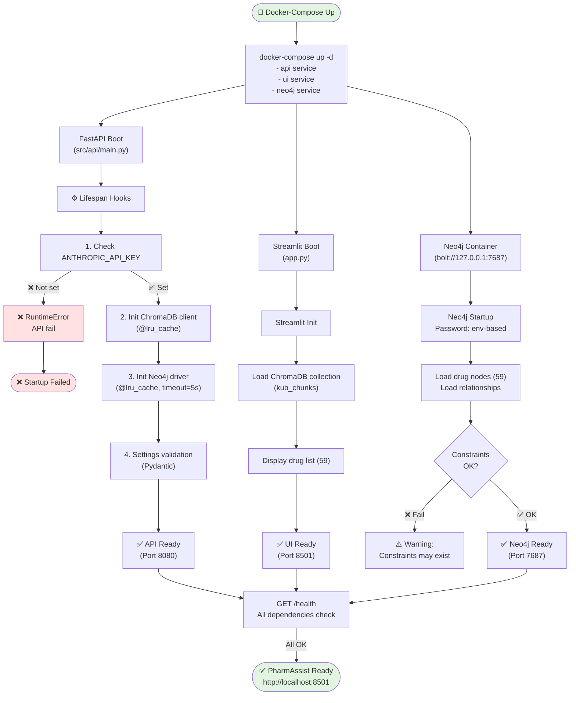
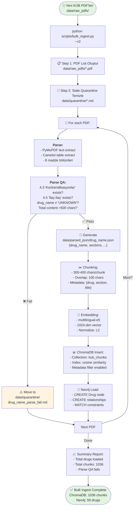
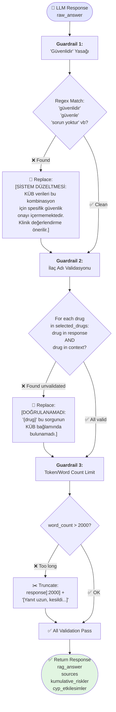

# PharmAssist: Activity Diagrams

## Activity Diagram 1: Sorgu İşleme Pipeline (11 Adım)

```mermaid
graph TD
    Start([👤 Klinisyen Sorgu Gönderir]) -->|POST /query| A1["<b>Adım 1:</b> Hasta Profili Alımı<br/>- Yaş, cinsiyet, lab_values<br/>- renal/hepatic status"]
    
    A1 -->|Validasyon| A1V{Geçerli mi?}
    A1V -->|❌ Fail| Error1["⚠️ ValidationError<br/>(400 Bad Request)"]
    Error1 --> End1(["❌ Sonlandır"])
    A1V -->|✅ Pass| A2["<b>Adım 2:</b> Sorgu Tipi Tahmini<br/>- Anahtar kelime analizi<br/>- kontrendikasyon/etkileşim/doz"]
    
    A2 --> A3["<b>Adım 3:</b> Section-Based Filtering<br/>- query_type → KÜB bölümü<br/>- metadata filter hazırla"]
    
    A3 --> A4["<b>Adım 4:</b> ChromaDB Retrieval<br/>- Embedding oluştur<br/>- Primary k=8, Secondary k=4<br/>- Latency: ~150ms"]
    
    A4 -->|Sonuç?| A4C{Chunks bulunamadı mı?}
    A4C -->|❌ 0 chunks| Error2["⚠️ No relevant docs<br/>→ Fallback msg"]
    Error2 --> End2(["⚠️ Partial Response"])
    A4C -->|✅ 8-12 chunks| A5["<b>Adım 5:</b> Cross-Encoder Reranking<br/>- Relevance scoring<br/>- Top-8 seç<br/>- Latency: ~50ms"]
    
    A5 --> A6["<b>Adım 6:</b> Neo4j Graph Retrieval<br/>- Drug-drug relationships<br/>- Cypher: INTERACTS_WITH<br/>- Latency: ~200ms"]
    
    A6 -->|Graph sonuç| A6R{İlaç etkileşimi var mı?}
    A6R -->|Evet| A6Y["✅ Interaction found<br/>severity/mechanism"]
    A6R -->|Hayır| A6N["⚠️ No relationship<br/>ChromaDB'ye güven"]
    A6Y --> A7
    A6N --> A7["<b>Adım 7:</b> Kümülatif Risk Analizi<br/>- 9 kategori: ADR, böbrek,<br/>karaciğer, CYP450, polifarmasi vb<br/>- Risk level: HIGH/MODERATE/LOW"]
    
    A7 --> A8["<b>Adım 8:</b> CYP450 Enzyme Mapping<br/>- Substrate/Inhibitor/Inducer<br/>- CYP3A4, CYP2D6, CYP2C9 vb<br/>- Interaction chain tespit"]
    
    A8 --> A9["<b>Adım 9:</b> Bağlam Formatı<br/>+ MUTLAK KURAL Prompt<br/>- ChromaDB + Neo4j + CYP450<br/>- 'Bağlamda olmayan yazma'"]
    
    A9 --> A10["<b>Adım 10:</b> LLM Inference<br/>- claude-haiku-4-5-20251001<br/>- max_tokens=1400, temp=0<br/>- Latency: ~800ms<br/>- Cost: $0.009"]
    
    A10 -->|LLM Response| A10C{API başarılı mı?}
    A10C -->|❌ Timeout| Error3["⚠️ API Timeout<br/>→ Retry or fallback"]
    Error3 --> End3(["⚠️ Partial Response"])
    A10C -->|✅ 200 OK| A11["<b>Adım 11:</b> Output Validation<br/>- 'Güvenlidir' yasağı (regex)<br/>- İlaç adı validasyonu<br/>- Token limit (2000 words)"]
    
    A11 -->|Validasyon| A11C{Hata var mı?}
    A11C -->|Evet| A11F["🔧 Fix: Replace pattern<br/>→ '[SİSTEM DÜZELTMESİ: ...]'"]
    A11F --> A12
    A11C -->|Hayır| A12["✅ Response Ready<br/>- rag_answer<br/>- sources<br/>- kumulative_riskler<br/>- cyp_etkilesimler"]
    
    A12 --> End4(["✅ 200 OK Response<br/>Klinisyen'e döndür"])
    
    style Start fill:#e1f5e1
    style End4 fill:#e1f5e1
    style Error1 fill:#ffe1e1
    style Error2 fill:#ffe1e1
    style Error3 fill:#ffe1e1
```



---

## Activity Diagram 2: Sistem Başlangıcı (Startup)



---

## Activity Diagram 3: Veri Alımı & İşleme (Ingestion)



---

## Activity Diagram 4: Output Validation (Guardrails)



---

## Key Metrics (Aktivite Metrikleri)

| Aktivite | Latency | Kritik | Hata Handling |
|----------|---------|--------|---------------|
| ChromaDB Retrieval | ~150ms | HIGH | Cache fallback |
| Cross-Encoder Reranking | ~50ms | MEDIUM | Skip if timeout |
| Neo4j Graph Query | ~200ms | MEDIUM | Query timeout=5s |
| LLM Inference | ~800ms | CRITICAL | Retry 2x, then fallback |
| Output Validation | ~20ms | HIGH | Strict (must pass) |
| **Total Pipeline** | **~2.1s** | **CRITICAL** | Timeout=3s |

---

## Error Handling Strategy

```
Request başarısız mu?
    ├─ ChromaDB fail → Fallback: default message
    ├─ Neo4j fail → Continue: ChromaDB results only
    ├─ LLM timeout → Retry 2x, then: generic response
    ├─ Validation fail → Fix: apply guardrail replacements
    └─ All fail → 503 Service Unavailable

Response quality
    ├─ Faithfulness < 0.65 → ⚠️ Warning flag
    ├─ No sources → ❌ Reject
    └─ Unknown drug in answer → 🔧 Mark as [DOĞRULANAMADI]
```
