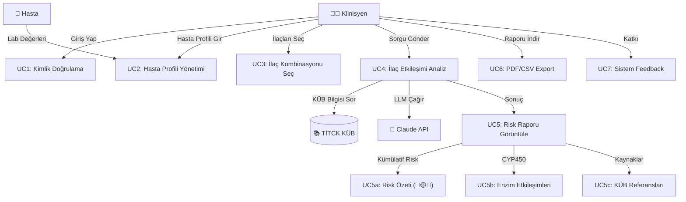

# PharmAssist: Use Case Diagram

## Use Case Tanımları

### Primary Actors (Ana Aktörler)
- **Klinisyen:** Hasta ilaç kombinasyonu hakkında karar almak isteyen doktor/eczacı

### Secondary Actors (Yardımcı Aktörler)
- **Hasta:** Profil bilgileri sağlar (yaş, lab değerleri)
- **TİTCK KÜB Database:** Güncel ilaç bilgileri kaynağı
- **Anthropic API:** LLM inference için

---

## Use Case Diagram (Mermaid)



---

## Detaylı Use Case Açıklamaları

### UC1: Kimlik Doğrulama
| Özellik | Değer |
|---------|-------|
| **Aktör** | Klinisyen |
| **Ön Koşul** | Streamlit açık, kimlik bilgileri yok |
| **Ana Akış** | 1. Klinisyen uygulamaya girer<br>2. Optional: API Key girer (PHARMASSIST_API_KEY set ise)<br>3. Sistem /health kontrol eder<br>4. ✅ Başarılı giriş |
| **Son Koşul** | Klinisyen uygulamaya erişim sağladı |

---

### UC2: Hasta Profili Yönetimi
| Özellik | Değer |
|---------|-------|
| **Aktör** | Klinisyen + Hasta |
| **Ön Koşul** | Kimlik doğrulamış klinisyen |
| **Ana Akış** | 1. Klinisyen "Hasta Profili" panelini açar<br>2. Yaş, cinsiyet girer<br>3. Lab değerleri input eder (Hgb, Creatinine, AST, ALT, INR vb)<br>4. Böbrek/Karaciğer durumu seçer<br>5. ✅ Profil kaydedilir |
| **Alternatif** | Hasta profili önceden var → yükler/günceller |
| **Son Koşul** | PatientProfile object oluşturuldu, validasyon geçti |

---

### UC3: İlaç Kombinasyonu Seçimi
| Özellik | Değer |
|---------|-------|
| **Aktör** | Klinisyen |
| **Ön Koşul** | Hasta profili complete |
| **Ana Akış** | 1. Multi-select dropdown açılır (59 ilaç)<br>2. Klinisyen ilaçları seçer (min 2)<br>3. Sorgu tipi (otomatik tespit): kontrendikasyon/etkileşim/doz vb<br>4. ✅ Seçim kaydedilir |
| **Validation** | İlaç adları ChromaDB'de var mı kontrol et |
| **Son Koşul** | selected_drugs list, query_type belirli |

---

### UC4: İlaç Etkileşimi Analiz (CORE)
| Özellik | Değer |
|---------|-------|
| **Aktör** | Klinisyen (trigger) + Sistem |
| **Ön Koşul** | UC2 + UC3 complete |
| **Ana Akış** | 1. POST /api/v1/query gönderilir<br>2. **Adım 1-5:** ChromaDB retrieval + reranking<br>3. **Adım 6-8:** Neo4j + Risk Analysis + CYP450<br>4. **Adım 9-10:** LLM inference (Claude Haiku)<br>5. **Adım 11:** Output validation (guardrails)<br>6. ✅ RAGResponse döner |
| **Hata Senaryosu** | - ChromaDB unavailable → cached result<br>- Neo4j fail → sadece vector arama<br>- API timeout → "Sistem meşgul, lütfen tekrar deneyin"<br>- LLM fail → fallback message |
| **Son Koşul** | RAGResponse (answer, sources, risks, cyp_interactions) |
| **Latency** | ~2.1 sec |
| **Cost** | $0.009/query |

---

### UC5: Risk Raporu Görüntüleme
| Özellik | Değer |
|---------|-------|
| **Aktör** | Klinisyen |
| **Ön Koşul** | UC4 başarıyla tamamlandı |
| **Ana Akış** | 1. Streamlit panelinde yanıt görüntülenir<br>2. **UC5a:** Risk özeti (🔴 HIGH / 🟡 MODERATE / 🔵 LOW)<br>3. **UC5b:** CYP450 enzim etkileşimleri<br>4. **UC5c:** Kaynaklar (KÜB madde referansları)<br>5. Klinisyen okur, karar verir |
| **Interaktif** | - Expandable risk categories<br>- Kaynağa tıkla → KÜB metnini göster<br>- Print/Screenshot butonu |
| **Son Koşul** | Klinisyen bilgili karar alabilir |

---

### UC6: Rapor Export
| Özellik | Değer |
|---------|-------|
| **Aktör** | Klinisyen |
| **Ön Koşul** | Risk raporu görüntülendi |
| **Ana Akış** | 1. "İndir" butonu tıklanır<br>2. Format seçilir (PDF / CSV)<br>3. ✅ Dosya indirilir |
| **CSV İçeriği** | Patient_ID, Drug1, Drug2, Risk_Level, Reasoning, Timestamp |
| **PDF İçeriği** | Formatted report with logos, tables, sources |

---

### UC7: Sistem Feedback
| Özellik | Değer |
|---------|-------|
| **Aktör** | Klinisyen |
| **Ön Koşul** | Rapor görüntülendi |
| **Ana Akış** | 1. "Feedback" butonu<br>2. "Yanıt doğru muydu?" (Y/N)<br>3. Detaylı feedback gir<br>4. ✅ Veri collection için kaydedilir |
| **Amaç** | RAGAS improvement, model tuning için data |

---

## Sistem Boundaries (Sistem Sınırları)

```
┌─────────────────────────────────────────────────────────────┐
│                    PharmAssist CDSS Sistemi                │
│                                                             │
│  ┌─────────────────┐         ┌──────────────────┐          │
│  │  Streamlit UI   │         │   FastAPI        │          │
│  │  (Port 8501)    │◄───────►│   (Port 8080)    │          │
│  └─────────────────┘         └──────────────────┘          │
│         │                            │                      │
│         │                            ├─ ChromaDB (1036)    │
│         │                            ├─ Neo4j (59 drugs)   │
│         │                            ├─ Claude Haiku API   │
│         │                            └─ Settings/Config    │
│         │                                                   │
│  ┌─────────────────────────────────────────────────────┐  │
│  │         Data Layer (src/)                           │  │
│  │  ├─ agents/ (RAG engine, patient profile)          │  │
│  │  ├─ analysis/ (cumulative risk, CYP450)            │  │
│  │  ├─ retrieval/ (ChromaDB, reranking)               │  │
│  │  ├─ graph/ (Neo4j queries)                         │  │
│  │  └─ ingestion/ (PDF parsing)                       │  │
│  └─────────────────────────────────────────────────────┘  │
│                                                             │
└─────────────────────────────────────────────────────────────┘
         │                              │
         ▼                              ▼
    ┌─────────────┐           ┌──────────────────┐
    │  Klinisyen  │           │ TİTCK KÜB (raw)  │
    │   (UI)      │           │ Anthropic API    │
    └─────────────┘           └──────────────────┘
   (External Actor)           (External System)
```

---

## Non-Functional Requirements (İşlevsel Olmayan Gereksinimler)

| Kategori | Gereksinim |
|----------|-----------|
| **Performance** | Response time: <3 sec, Avg: 2.1 sec |
| **Availability** | 99.5% uptime (Neo4j/ChromaDB healthy) |
| **Security** | X-API-Key header (optional), CORS controlled |
| **Usability** | Türkçe UI, intuitive forms, clear error messages |
| **Accuracy** | RAGAS Faithfulness ≥0.78 |
| **Scalability** | 100+ concurrent users, 60+ drugs |
| **Data Privacy** | GDPR/KVKK compliant, patient data encrypted |
